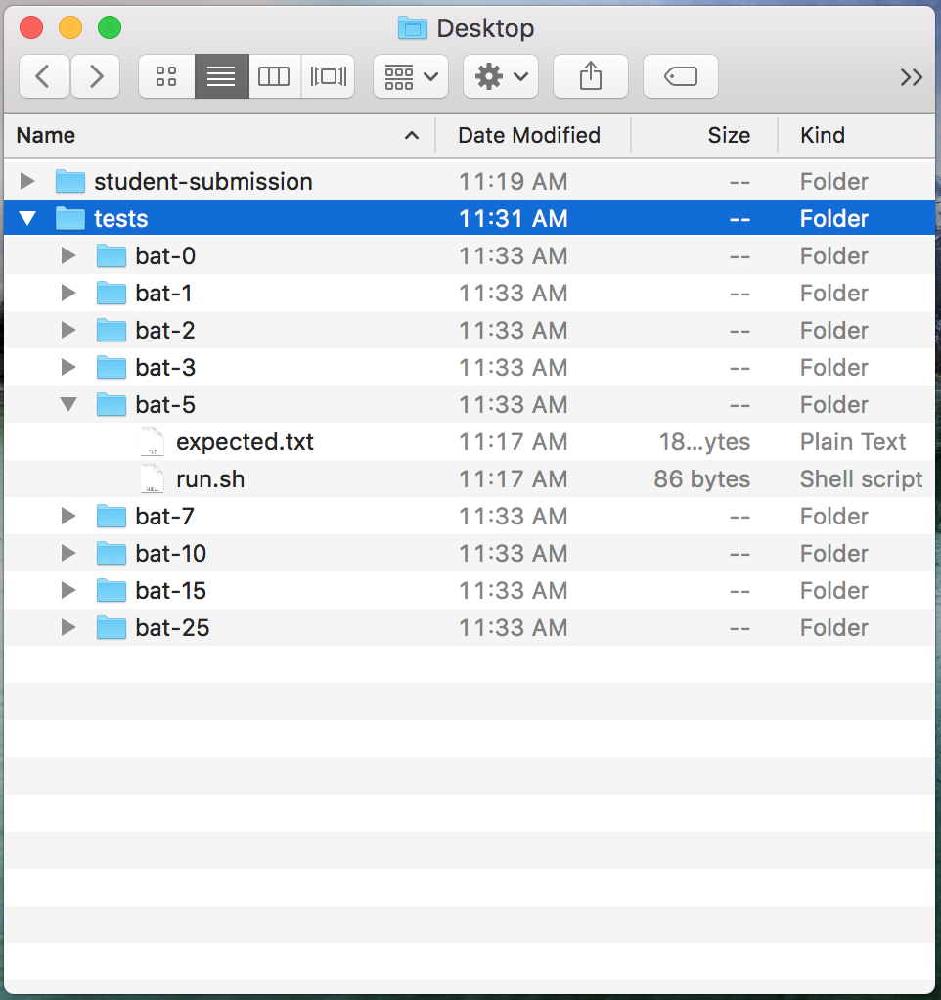
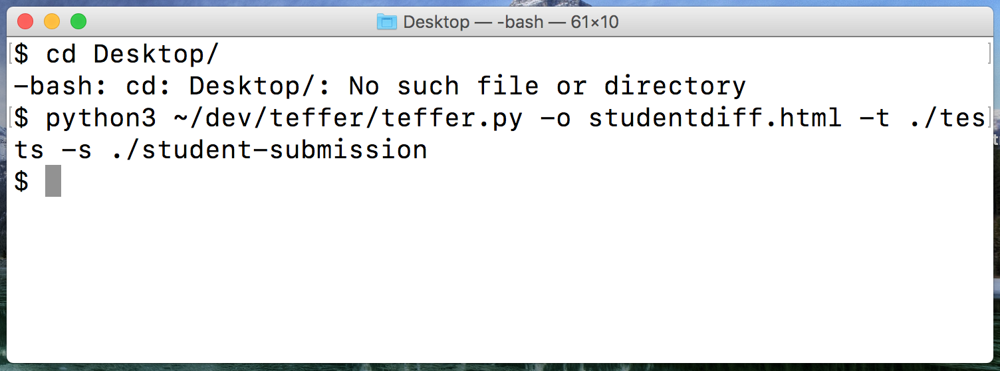

# Teffer

Teffer (TEst diFFER) is a python-based tool used for automated testing.
The tool runs an input program against a set of textual tests.
For each test, teffer generates a diff.
All of the diffs are combined and inserted into an html output, which can be viewed in your browser of choice.


## Writing Tests

Teffer test-cases are made by creating a single directory full of subdirectories.
Each subdirectory represents a single teffer test case.
Each individual test directory should contain the following files:

* `run.sh` : A bash script which will be executed by teffer, with the current working directors as the execution directory.
             Within `run.sh`, the test-writer may use the token `BASE_DIR`, and teffer will replace this with the directory specified to the `-s` option of teffer (the directory with the code file to be tested).
             The test-writer can also use the `TEST_DIR` directory, which teffer will replace with the directory of the test case.
* `expected.txt` : A text file containing the expected output of this particular execution of your program.

Each test directory should also contain any necessary resource files needed for the test, such as input files.

A top-level test directory will have a structure that looks similar to this:

```
$ tree tests/
tests/
├── some-test
│   ├── resource-1.txt
|   ├── resource-2.txt
│   ├── run.sh
│   └── expected.txt
├── another-test
│   ├── resource-X.txt
│   ├── run.sh
│   └── expected.txt
└── cool-test
    ├── run.sh
    └── expected.txt
```

Teffer will generate an `actual.txt` alongside each `expected.txt` after being executed.
The `actual.txt` is the captured stdout from running the command in `run.sh`.
Teffer will diff `actual.txt` and `expected.txt`.
Teffer will generate an HTML file containing all of the diffs from the test run.
This HTML file can be viewed in a web-browser.

See the `teffer/tests` directory for a few example test cases.


## Command-line arguments

See `teffer.sh -h` for details of command-line options.


## Testing

Teffer has a default test suite, located in the `./tests`.
Since teffer itself is a testing framework, we use teffer to test itself.
To run the teffer tests, just execute:

```
python3 teffer.py
```


## Walkthrough

Below is a step-by-step guide to running teffer on some test cases.
The test-cases used are from a programming assignment given in CS 110 at the UofA.

### 1) Create tests
Use or create a set of test cases to run teffer on.
Show below is a screenshot of the contents of a `tests` directory.



The test directory contains many tests, each with a `run.sh` and an `expected.txt` file.
Below are the contents of these two files in the `bat-5` directory:

```
sed -i '' -e 's/^BAT_WIDTH.*/BAT_WIDTH = 5/g' BASE_DIR/bat.py
python3 BASE_DIR/bat.py
```

```
\****\_____      /\_/\      _____/****/
 \    *****\_____|* *|_____/*****    / 
  \         *****| - |*****         /  
   \_______ *****||*||***** _______/   
                 {   }
```

### 2) Get a program to test

The `student-submission` directory contains a script named `bat.py`.
I'm not going to show the contents here, so the solution isn't blown :).

### 3) Run teffer

The easiest way to run deffer is in the shell.
Open up terminal and navigate to the desktop.
From there, you'll need to run `teffer.py` with a few command-line arguments, like so:



Using the command-line arguments, teffer was told what directory the test-cases were in, what directory the solution was in, and the name of the diff file to generate.

### 4) Check the diff

After the run, you can double-click the `studentdiff.html` file to open it up in your browser.
From here, you'll be able to check how many test-cases the student passed.

